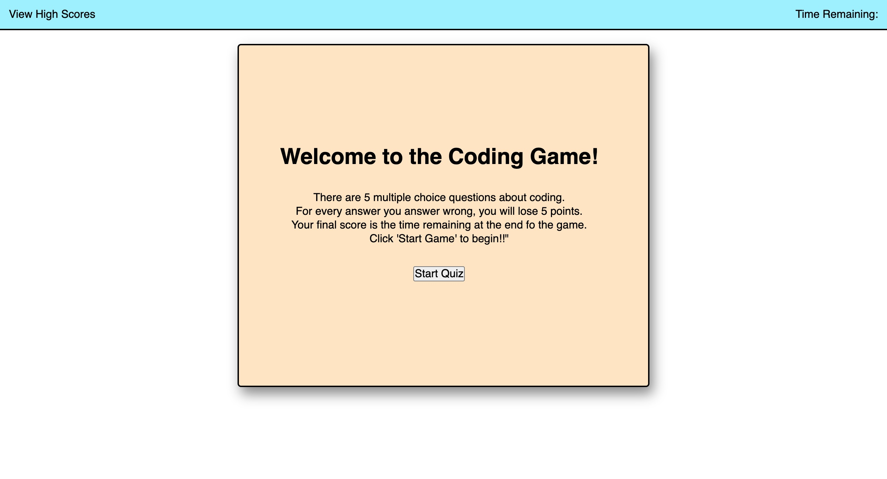

# Homework 4: code-quiz
## Objective:

The objective of this assignment was to use JavaScript to create a coding quiz game. The quiz needed to be 5 questions long with mutliple choice answers. When the user gets the answer incorrect, 5 seconds were subtracted from the timer and the next question appears. After the user completes the test, they get to a an End Quiz page where their final score is submitted and then the user needs to submit their initials and click to go to the final scores page. 

To start, I created the html file with multiple div, class, and id tags so that I could reference them in the JavaScript file. Next, I created a script.js file and worked on creating the question bank and functions to go through each of the questions and then proceed to the end page. The last step was to create a high scores page that creates a list of all the high scores stored in the storage log. 

## Screenshot of Homepage

## Link to deployed code
https://kesjoberg.github.io/code-quiz/
